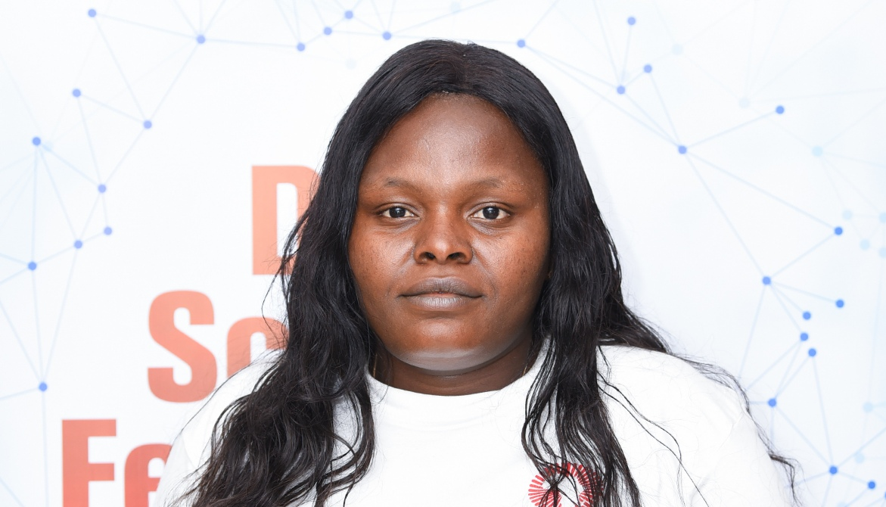
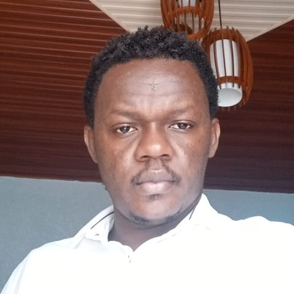
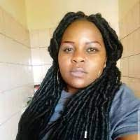
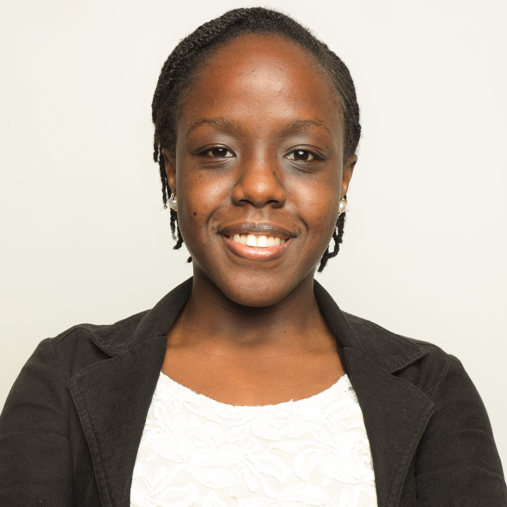
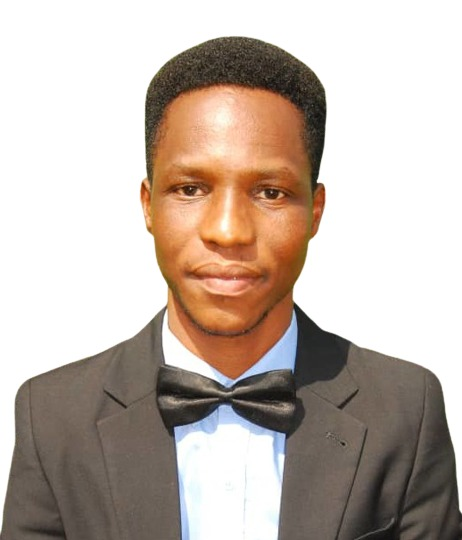
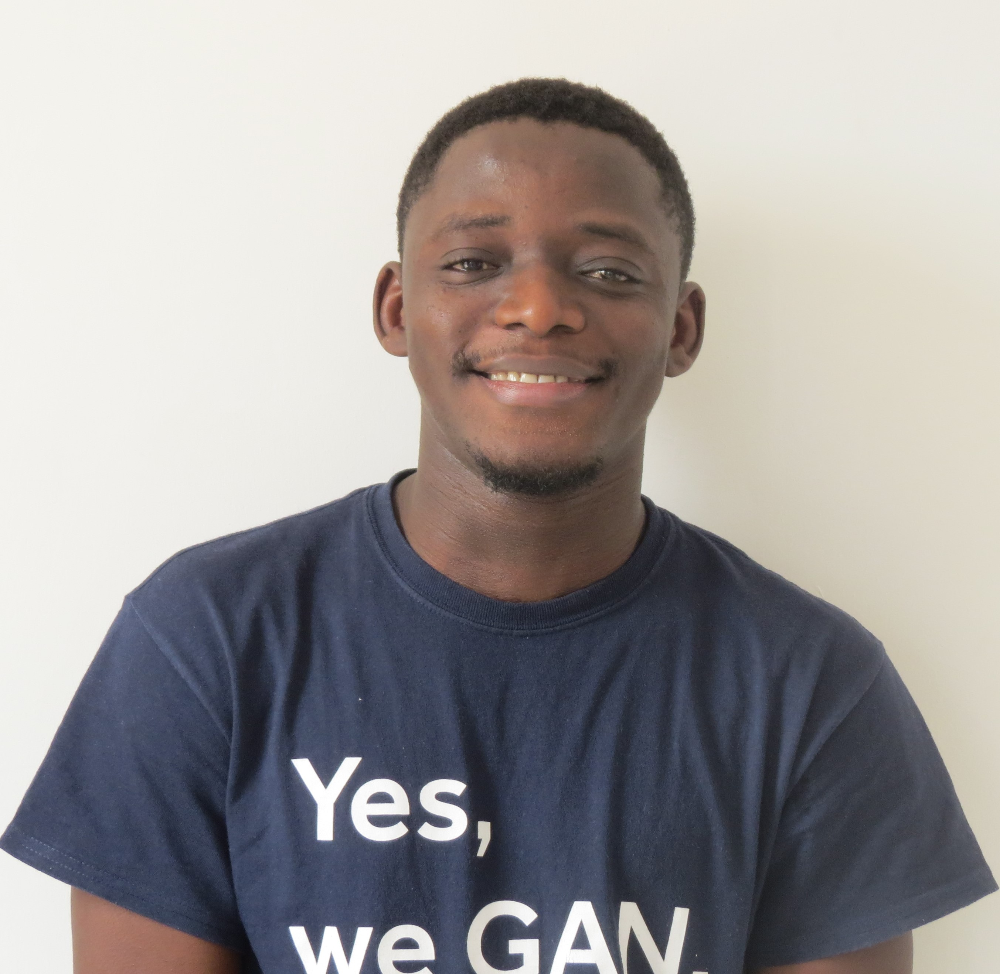
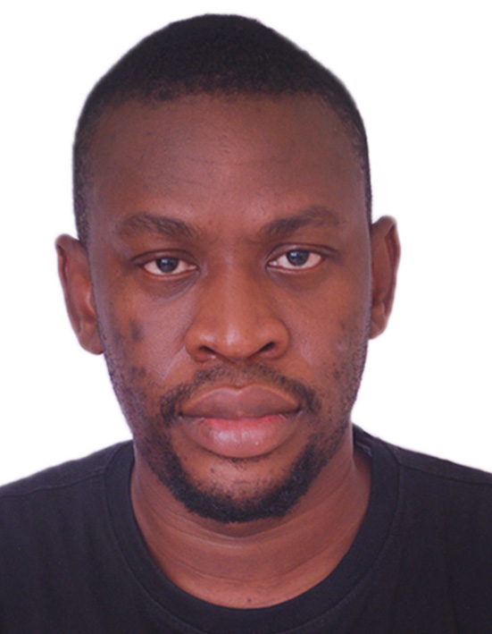
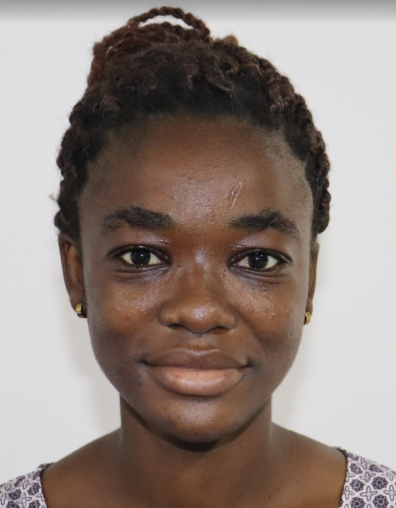

 
          

[**Serge Adonsou**](https://tg.linkedin.com/in/serge-adonsou-339894201) has a background in mathematics (pure and applied) namely number theory and mathematical modeling. Currently his research interest is quantum information and quantum computing particularly quantum algorithms designing and also topological quantum computing.

[**Aulan L. Zahoundo**](www.linkedin.com/in/aulan-zahoundo) has joined the structured master's program in 2019 in South Africa after completing a master's degree at [**IMSP**](http://imsp-benin.com/home/) in theoretical physics. Currently, she is enrolled as a research master's student at Quantum Leap Africa in Rwanda. My research is focused on quantum error correction and machine learning.

[**Chanelle M. Manfouo**](https://cm.linkedin.com/in/chanelle-matadah-manfouo-00a946130)  I am from Cameroon. I graduated from the [**University of Ngaoundere**](http://www.univ-ndere.cm/) where I studied mathematics and computer science. After that, I did a structured master's in mathematical sciences at AIMS Cameroon and a research master's in computer science with a focus on quantum cryptography at Quantum Leap Africa. Currently, I am a PhD student in data science at Quantum Leap Africa and at the University of KwaZulu-Natal. My research seeks to review and propose possible optimization of quantum subroutines for some machine learning algorithms. Then, implement the improved version of the latter on real datasets to evaluate their efficiency and practicality. My research interest is in quantum information, quantum machine learning, quantum cryptography, and data science.

[**Jodelle A. Kemme**](https://www.linkedin.com/in/aur%C3%A9lie-jodelle-kemme-5a07)  I am a Cameroonian with a fastinanted problem solving skills.
I hold a bachelor degree in Pure mathematics from the [**University of Douala**](https://www.univ-douala.cm/) in Cameroon) and a master degree in Industrial
mathematics from the African Institute for mathematical Science (AIMS Cameroon). I worked previously as a software ingenieur at the Climate Application and Prediction Center (CAPC-AC) where I succeded to build an interface user-machine to help them manage their climatic and meteorological database. I was part of the Ishango data science fellowship program where I worked with [`tails.com`](https://tails.com/gb/) which is a UK based company supplying tailored dogs foods. I designed a data driven marketing strategy to help [`tails.com`](https://tails.com/gb/) improves their customers experience and satisfaction. I am currently working as a research master in data science at Quantum Leap Africa. I am passionated on turning data into business solution and she enjoy helping other.

  
 

[**Domini J. Leko**](https://cg.linkedin.com/in/domini-jocema-leko-moutouo-644b5799) I am a Congolese whose passion is mathematics. I obtained my master's degree in teaching Mathematics from [**Marien Ngouabi University**](https://www.umng.cg/) at Ecole Normale Supérieure before joining the structured master’s graduate program with the African Institute for Mathematical Sciences in South Africa. After five years of teaching at the Secondary level, I joined Quantum Leap Africa as a research master's student. My research focused on Topological data analysis and machine learning.

 
 
 
 

[**Nelie L. Makenne**](https://www.linkedin.com/mwlite/in/nelie-laura-makenne-66887215b) I am Nelie Laura MAKENNE from Cameroon, I hold a master's degree in Computer Science from [**Dschang Uniersity**](https://www.univ-dschang.org/), Cameroon. I am also an AIMS Cameroon Alumni cohort 2019/2020. I previously worked at [**Nzhinusoft**](https://nzhinusoft.com/) Cameroon as software engineer where my job was to develop and maintain e-commerce websites. I am currently a research master student in data science at quantum leap africa where my research is focused in convex optimization for data classification.

 
 
 

[**Everlyn A. Chimoto**](https://www.linkedin.com/in/everlyn-asiko/) I am a machine translation researcher from Kenya. I am currently studying at [**University of Cape Town**](http://www.uct.ac.za/) as a research master's student. I have a BSc in Computer Science (First Class Honours) from [**Masinde Muliro University of Science and Technology**](https://www.mmust.ac.ke/); an MSc in Mathematical Sciences(With Distinction) from the African Institute for Mathematical Sciences(AIMS)/University of Cape Town(UCT). I was awarded Paul G. Allen Family Foundation Scholarship for outstanding achievement on my Master's. My research interest lies in Machine Translation for low-resource languages. My MSc research was on Neural Machine Translation for Low-Resource Languages supervised by Professor Bruce Bassett. I am also a member of the Masakhane community that strengthens NLP research in African languages.

 

[**John Bagiliko**](https://www.researchgate.net/profile/John-Bagiliko)  I am a Ghanaian. I am currently a PhD candidate with Quantum Leap Africa at the African Institute for Mathematical Sciences (AIMS Rwanda), and the University of Rwanda. I obtained my BSc. Mathematics from the [**University for Development Studies**](https://uds.edu.gh/), Navrongo, Ghana, in 2017. I subsequently obtained an MSc. Mathematical Sciences (Big Data and Computer Security) from AIMS Senegal, in 2019.   
My research interests are Data Science, Machine Learning, Remote Sensing, Climate Change, and Applied Mathematics. I recently interned with the International Crops Research Institute for the Semi-Arid Tropics, ICRISAT, Mali where I researched on leveraging machine learning with satellite images for plot delineation in the African rain-fed agriculture setting.  I write, listen to music, and play the trumpet at my leisure.

 

[**Jeremiah Fadugba**](https://www.linkedin.com/in/jeremiah-fadugba-5b3a5375/) I am a PhD Candidate in Computer Science at the [**University of Ibadan**](https://www.ui.edu.ng/), Nigeria and a doctoral fellow in data science at the African Institute for Mathematical Science (AIMS), Rwanda. Previously, I have worked as a Data Scientist and Machine Learning Engineer for various organizations. My current research interest is in medical applications of machine learning and artificial intelligence. I look forward to the development of AI-enabled medical solutions for developing countries.

[**Assionvi H. Kouevi**](https://www.linkedin.com/in/assionvi-hove-kouevi-34a429142/) I joined Quantum Leap Africa at AIMS Rwanda as postdoctoral research fellow in Data Science in December 2021. After completing my PhD in applied mathematics and computer sciences at [**Heriot-Watt University**](https://www.hw.ac.uk/) (in 2018, Scotland) with two internships programs with [**Schlumberger Gould Research Centre**](https://www.cambridgetrust.org/partners/schlumberger-gould-research-centre) in Cambridge (in 2015 and 2017, United Kingdom), I held the position of teaching assistant at AIMS Rwanda from 2019 to 2021. My research interests are in the area of applied computational mathematics (e.g. numerical analysis, machine learning), developing efficient numerical techniques to simulate or invert systems and proving convergence, stability. My recent works look at deep learning-based data transmission scheduling for cognitive internet of things, the modelling of electrochemical sensors and simulating fluid flow through complex domains. My current work focuses on the theoretical and numerical  analysis of machine learning for scientific computing method called physics-informed neural networks which is used to solve, invert and discover PDEs via deep learning, hence removing the tyranny of grids and the use of gapy data only.

	
 
 

[**Abigail Baidoo**](https://gh.linkedin.com/in/abigail-baidoo-a08b881ab) I am a Ghanaian. 
I hold a Master of Philosophy degree in Mathematics from the University of Cape Coast and a Master of Science degree from the AIMS-Ghana / University of Ghana. 
My research focuses on the application of data science techniques to microfinance operations.

## Our partners

[**AIMS-NEI**](https://aims.ac.za/).

 

[**Canergie Coporation**](https://www.carnegie.org/).

 

 

[**University of Rwanda**](https://ur.ac.rw/).

[**African Center of Excellence in Data Science**](https://aceds.ur.ac.rw/).

